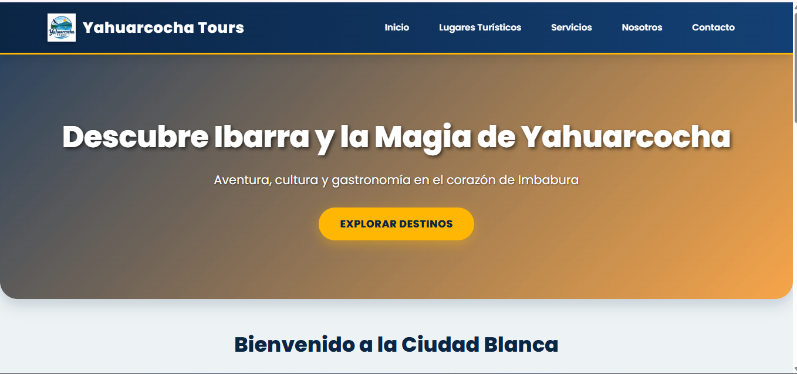

# Nombre del proyecto: Yahuarcocha Tours

## Nombre del estudiante
[Clara Lucia Guerra Toaquiza]

## Destino turístico asignado
Ibarra / Yahuarcocha - Imbabura, Ecuador

## Descripción del proyecto
Desarrollo de un sitio web para una agencia turística ficticia enfocado en la promoción de Ibarra y la Laguna de Yahuarcocha. El proyecto incluye información sobre atractivos naturales, eventos en el autódromo, gastronomía típica (tilapia frita y helados de paila), rutas de aventura y patrimonio histórico cultural.

## Tecnologías utilizadas
- HTML5 (Estructura semántica, listas, multimedia, formulario de contacto validado)
- CSS3 (Hoja externa, modelo de caja, Flexbox, CSS Grid, fuentes, selectores y media queries)
- Git & GitHub (Control de versiones)
- GitHub Pages (Alojamiento público del sitio web)

## Captura del sitio

## URL del sitio publicado
https://cguerrat-tech.github.io/agencia-turismo/